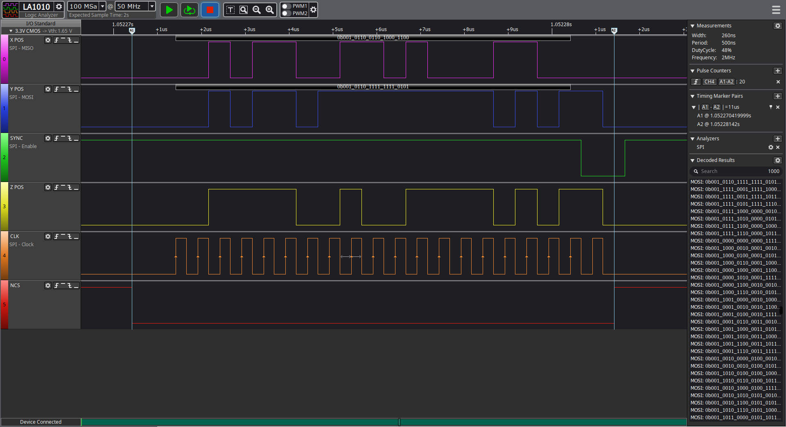
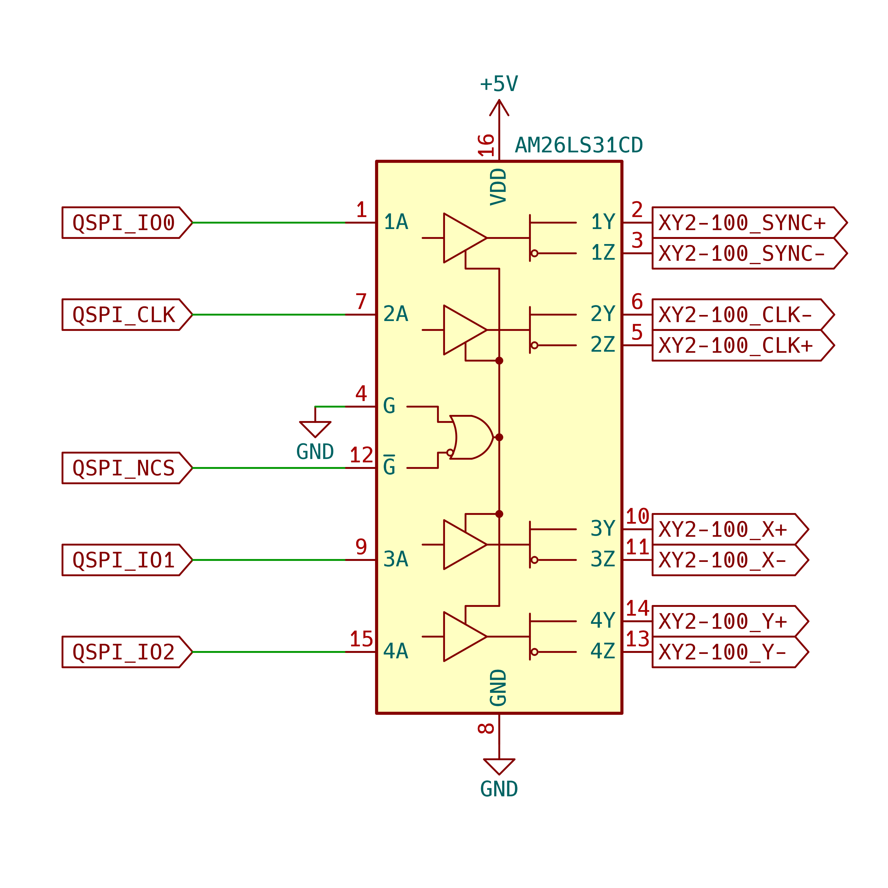

# qspi4xy2-100
This repository is an open-source project that offers a complete implementation of the XY2-100 protocol using the QSPI interface.



## Pinout
The following table shows the pinout of the QSPI interface.

| Quad SPI Pins | XY2-100 Funcs | Polarity | Description |
|--------------:|--------------:|:--------:|:------------|
| CLK           | CLK           | -        | Clock. |
| NCS           | N.A.          | N.A.     | Not used. But it can be used as a busy signal or chip select of differential line drivers. |
| IO0           | SYNC          | +        | Synchronization signal. |
| IO1           | Channel X     | +        | Channel X data. |
| IO2           | Channel Y     | +        | Channel Y data. |
| IO3           | Channel Z     | +        | Channel Z data. If the XY2-100 is configured as a 2D sensor, this pin is not used. |

## Connection
The XY2-100 protocol is a differential protocol. Therefore, the QSPI pins must be connected to a differential line driver.
A AM26LS31 is a good choice for this purpose, it works with 5V power supply and accepts 3.3V TTL input signals.
The output of the AM26LS31 is TIA/EIA-422 compatible, so it can be connected to most XY2-100 devices directly.
But any other differential buffer can be used if it meets the requirements of both the microcontroller side and the XY2-100 device side.

> **Note:** If the XY2-100 device is configured as a 3D sensor, at least two differential line drivers are needed to support the three channels + synchronization signal + clock signal.

## Polarities
The XY2-100 protocol uses a default high polarity for the clock signal and a default low polarity for the synchronization signal.
The data signals are sampled on the falling edge of the clock signal.
We can change the polarity of the clock signal by swapping the clock output pins of the differential line driver.



> **Note:** To avoid the high impedance state of the differential line driver, the output of the line driver should be connected pull-up or pull-down resistors.

## Configuration of QSPI
Use the QSPI peripheral of a STM32 microcontroller as an example.
The following items must be configured in the QSPI peripheral:
- Clock prescaler. The clock frequency should set to 2MHz. That means the prescaler value should the (Freq_QSPI / 2MHz) - 1.
- FIFO threshold. The FIFO threshold should be set to 1.
- No sample shift. The data should be sampled on the rising edge of the clock signal.
- Flash size. The flash size should be set to 31.
- Chip select high time. The chip select high time should be set to 1 cycle.
- Clock mode. The clock mode should be set to Low.

```c
QSPI_CommandTypeDef qspi_cmd = {
    .InstructionMode = QSPI_INSTRUCTION_NONE,
    .Instruction = 0x00,
    .AddressMode = QSPI_ADDRESS_BYTES_NONE,
    .AddressSize = QSPI_ADDRESS_8_BITS,
    .Address = 0x00,
    .AlternateByteMode = QSPI_ALTERNATE_BYTES_NONE,
    .AlternateBytesSize = QSPI_ALTERNATE_BYTES_8_BITS,
    .AlternateByte = 0x00,
    .DummyCycles = 0,
    .DataMode = QSPI_DATA_4_LINE,
    .NbData = 10,
    .DdrMode = QSPI_DDR_MODE_DISABLE,
    .DdrHoldHalfCycle = QSPI_DDR_HHC_ANALOG_DELAY,
    .SIOOMode = QSPI_SIOO_INST_EVERY_CMD
};
```

## Usage
The following code snippet shows how to send a command to the XY2-100 device.

```c
#include "qspi4xy2-100.h"

HAL_QSPI_Command(&hqspi, &qspi_cmd, 10);

uint8_t data[10];

// x, y, z positions should be 16-bit values.
q4x_make_buffer(data, xpos, ypos, zpos);

// Send the data buffer to the XY2-100 device. Timeout is 1ms.
HAL_QSPI_Command(&hqspi, data, 1);
```

## License
This project is licensed under the GNU General Public License v3.0 - see the [LICENSE](./LICENSE) file for details.

